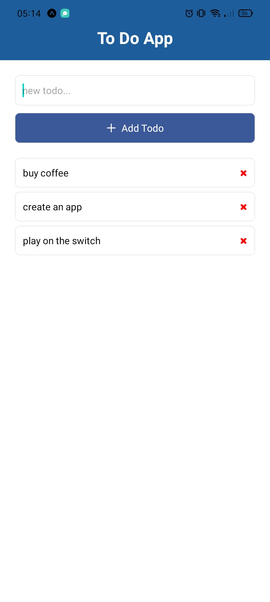

# React-Native App
Aplikasi sederhana untuk membuat todo list

## Instalasi
Instruksi untuk menginstal dan menjalankan proyek di lingkungan pengembangan lokal.

# Clone repositori
git clone https://github.com/Tharixs/React-Native.git

# Masuk ke direktori proyek
cd nama-proyek

# Instal dependensi
npm install

# Jalankan proyek
npx expo start / npm start / yarn start / bun start

Kode di atas akan menghasilkan tampilan seperti ini:

 
